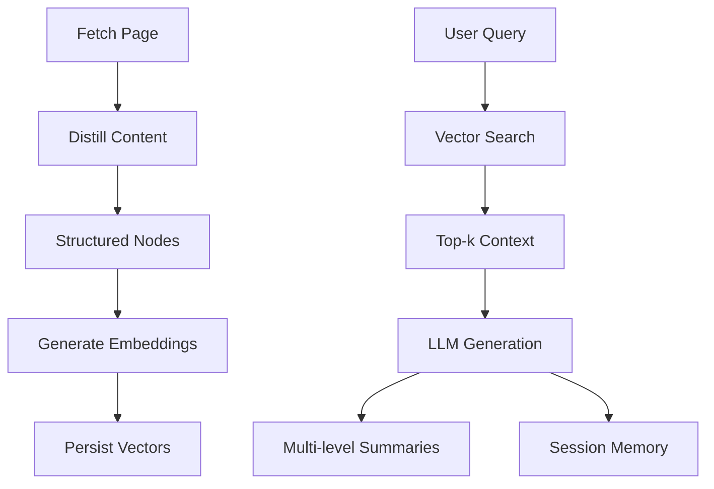

# Anno AI Layer Architecture (Draft)

## Layer Overview (A–H)
- **Layer A – Web Fetching:** Transport, caching, robots compliance.
- **Layer B – Content Processing:** Extraction ensemble (Ollama, Readability, DOM heuristics).
- **Layer C – Delivery:** JSONL streaming, provenance metadata.
- **Layer D – Semantic Intelligence (new focus):** embeddings, knowledge graph hooks, semantic search.
- **Layer E – Multi-Agent Swarm:** planned orchestrators for specialized research agents.
- **Layer F – Probabilistic Truth Engine:** Bayesian confidence scoring (baseline in place, needs expansion).
- **Layer G – Temporal Intelligence:** version tracking, drift detection.
- **Layer H – Reasoning Chain Support:** RAG, query planning, verification.

## Proposed Data Flow

## Key Modules (planned)
| Module | Responsibility |
|--------|----------------|
| `langchain-integration.ts` | Wrap LangChain providers, chains, and prompt templates |
| `vector-store.ts` | Uniform interface for storing and querying embeddings |
| `semantic-search.ts` | Similarity search, metadata filtering, ranking |
| `rag-pipeline.ts` | Retrieval + augmentation + generation orchestration |
| `memory.ts` | Session context persistence |
| `summarizer.ts` | Headline / paragraph / detailed summary generation |

Configuration is centralized under `config.ai` (see `src/config/env.ts`) where embedding, LLM, vector store, and summarizer providers can be selected per deployment.

## Confidence Scoring
- Existing heuristic gives 5D scores based on extraction quality.
- Extend to incorporate LLM confidence, retrieval overlap, source credibility.
- Document math once new scoring formulas are implemented.

## Ensemble Selection
- Distillation currently heuristically picks best extractor result.
- Plan: use embeddings + content quality metrics to select or blend extractor outputs.
- Placeholder: add decision matrix documentation once prototypes exist.

## Observability
- Metrics to capture: embedding latency, vector store query duration, RAG token usage, summarization cache hit rate.
- Extend `/metrics` endpoint with namespace `anno_ai_*`.

## Outstanding Questions
1. Which vector store backend ships as default (memory vs. Redis Stack)?
2. How to support offline workflows (local embeddings)?
3. Session memory retention policy and storage footprint.

> Update this file with final diagrams, configs, and lessons learned as Sprint 3 progresses.
